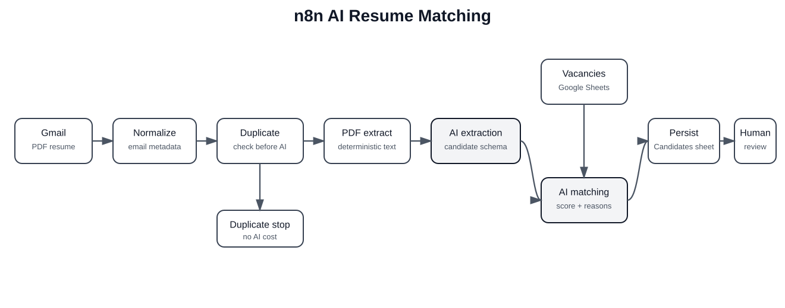

# n8n AI Resume Matching

[Русская версия](README.ru.md)

An end-to-end tested n8n workflow for AI-assisted resume intake and vacancy matching: Gmail receives PDF resumes, duplicate candidates are filtered before AI calls, resume data is extracted, vacancies are loaded from Google Sheets, an LLM produces structured matching results, and the workflow records the outcome and routes the next action.

> Portfolio focus: AI workflow orchestration, Gmail/PDF processing, structured extraction, cost-aware routing, Google Sheets integration, LLM matching, and human-in-the-loop production design.



## Pipeline

```text
Gmail + PDF resume
       │
       ▼
Normalize email
       │
       ▼
Duplicate check ── duplicate ──► stop without AI cost
       │
       ▼
Extract PDF text
       │
       ▼
Structured candidate extraction
       │
       ├───────────────┐
       ▼               ▼
Candidate data    Read vacancies
       │               │
       └──────┬────────┘
              ▼
      AI vacancy matching
              │
              ▼
      Structured JSON result
              │
              ▼
       Google Sheets log
              │
              ▼
      decision-support branch
```

## Engineering highlights

- **Gmail trigger with PDF attachments** for automated resume intake.
- **Deduplication before LLM calls** to avoid repeated processing and unnecessary token spend.
- **PDF text extraction** with deterministic file processing.
- **Structured AI extraction** for candidate data instead of free-form text parsing downstream.
- **Vacancy aggregation from Google Sheets** as a lightweight business-data source.
- **Structured matching output** with explicit scores/reasons rather than prose-only recommendations.
- **Persistence to Google Sheets** for review, traceability, and manual inspection.
- **Branching based on matching result** while keeping production hiring decisions subject to human review.

## End-to-end verification

The original implementation was run through the real Gmail-triggered flow with Gmail, Google Sheets, and OpenAI credentials connected. The successful run is documented by the source project's execution-history artifact and supporting configuration screenshots.

The original workflow also passed n8n workflow/node validation and connection checks. See [Evidence](docs/evidence.md) and [Testing](docs/testing.md).

## Responsible portfolio variant

The public workflow intentionally excludes `sex` and `birth_date` from the candidate fields used for matching. These attributes are unnecessary for evaluating job fit and should not influence automated recommendations.

The demo architecture contains invite/rejection routing because it mirrors the tested workflow. For real hiring, place a **human approval gate** before any candidate-facing decision or message. See [Privacy & Human Review](docs/privacy-and-human-review.md).

## Stack

`n8n` · `Gmail` · `PDF extraction` · `OpenAI` · `AI Agent` · `Structured Output` · `Google Sheets`

## Repository structure

```text
.
├── workflow/
│   └── resume-matching-pipeline.json
├── examples/
│   ├── vacancies.csv
│   └── candidate-result.json
├── docs/
│   ├── architecture.md
│   ├── setup.md
│   ├── testing.md
│   ├── evidence.md
│   ├── privacy-and-human-review.md
│   └── images/architecture.svg
├── .gitignore
├── LICENSE
├── README.md
└── README.ru.md
```

## Quick start

1. Import [`workflow/resume-matching-pipeline.json`](workflow/resume-matching-pipeline.json) into n8n.
2. Connect your own Gmail, Google Sheets, and OpenAI credentials.
3. Create Google Sheets tabs `Vacancies` and `Candidates` using the schemas in [Setup](docs/setup.md).
4. Re-select the spreadsheet in the Google Sheets nodes after import.
5. Test with synthetic/demo resumes only.
6. Verify duplicate, matching, persistence, and both decision-support branches before activation.

The public JSON is sanitized: original workflow/project IDs, credential IDs, account names, spreadsheet IDs, and environment-specific references are not included.

## Matching contract

The matching stage should return structured output similar to:

```json
{
  "matches": [
    {
      "vacancy": "Backend Engineer",
      "score": 78,
      "reasons": ["Relevant Python experience", "REST API experience"],
      "risks": ["Limited production Kubernetes exposure"]
    }
  ]
}
```

A score is a decision-support signal, not an autonomous hiring decision.

## Production extensions

A production deployment should add:

- human approval before candidate-facing outcomes;
- retention/deletion rules for personal data;
- role-based access to Gmail and candidate records;
- centralized error handling and alerting;
- audit/correlation IDs;
- idempotency beyond email-based duplicate detection;
- evaluation datasets for extraction and matching quality;
- bias/fairness review of matching criteria and prompts.

## License

MIT — see [`LICENSE`](LICENSE).
